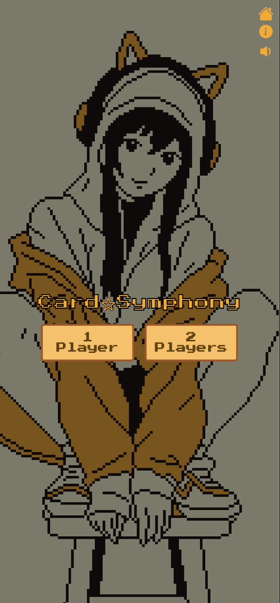

# Card☆Symphony
*Assets removed for copyright compliance - see demos below*

A nostalgic memory card game with an early 2000s anime aesthetic, featuring lofi background music and dynamic visuals that create an immersive gaming experience.

## Demos

### Single Player Mode - Desktop


### Multiplayer Mode - Desktop


### Multiplayer Mode - Mobile


### Random Selection of Background Images - Mobile



## Features

- **Single & Multiplayer Modes**: Play solo or challenge a friend in local multiplayer
- **Multiple Difficulty Levels**: Choose from 6 different card counts (12-36+ cards)
- **Dynamic Theming**: Randomly selected background images and card patterns for each game
- **Ambient Audio**: Relaxing lofi background music with mute/unmute controls
- **Progressive Web App**: Installable on mobile devices and works offline
- **Responsive Design**: Adaptive board layouts that scale with different card counts
- **Score Tracking**: Real-time scoring system for multiplayer matches
- **Early 2000s Anime Aesthetic**: Nostalgic visual design with vibrant colors and retro styling

## Technologies Used

- **Frontend**: React 18 with TypeScript
- **Build Tool**: Vite for fast development and optimized builds
- **State Management**: React Hooks (useState, useReducer, useEffect)
- **Styling**: CSS3 with custom animations and transitions
- **Icons**: Bootstrap Icons
- **Audio**: Web Audio API integration
- **Local Storage**: Persistent user preferences (mute settings)

## How to Play

1. **Choose Players**: Select single-player or two-player mode
2. **Select Difficulty**: Pick the number of cards (12, 16, 20, 30+ cards available)
3. **Find Matches**: Click cards to reveal them and find matching pairs
4. **Win Conditions**:
   - **Single Player**: Match all pairs to win
   - **Multiplayer**: Player with the most matches wins

## Getting Started

### Prerequisites
- Node.js (v16 or higher)
- npm or yarn package manager

### Installation

1. Clone the repository:
```bash
git clone https://github.com/mnsrt-pb/card-symphony.git
cd card-symphony
```

2. Install dependencies:
```bash
npm install
```

3. Start the development server:
```bash
npm run dev
```

4. Open your browser and navigate to `http://localhost:5173`

### Build for Production

```bash
npm run build
```

The built files will be in the `dist` directory.

## Progressive Web App

Originally planned for deployment to mobile app stores, Card☆Symphony was redesigned as a Progressive Web App (PWA) to provide a native-like experience without the annual developer fees. The PWA approach offers several advantages:

- **No App Store Dependencies**: Direct installation from the browser
- **Cross-Platform Compatibility**: Works on iOS, Android, and desktop
- **Offline Capability**: Can be played without an internet connection
- **Automatic Updates**: Users always get the latest version
- **Lower Barrier to Entry**: No app store approval process required

## Game Mechanics

- **Card Reveals**: Visual feedback when cards are selected and revealed
- **Match Detection**: Automatic detection of matching pairs with color-coded player feedback
- **Turn Management**: In multiplayer mode, turns alternate between players on mismatches
- **Scoring System**: Points awarded for each successful match in multiplayer
- **Dynamic Difficulty**: Board layout adapts to card count with responsive grid sizing
- **Random Generation**: Card positions, background images, and patterns randomized each game

## Audio Features

- **Background Music**: Continuous lofi soundtrack for ambient gaming
- **Audio Controls**: Toggle music on/off with persistent preference saving
- **Web Audio Integration**: Efficient audio handling with proper resource management

## Responsive Design

The game features adaptive layouts for different screen sizes and card counts:
- **XSmall Board**: < 10 pairs
- **Small Board**: 10 pairs
- **Medium Board**: 15 pairs
- **Large Board**: 18 pairs
- **XLarge Board**: 18+ pairs

## Project Structure

```
src/
├── components/          # React components
│   ├── Card.tsx        # Individual card component
│   ├── Game.tsx        # Main game logic and board
│   ├── Memory.tsx      # App root and menu system
│   └── BackgroundMusic.tsx # Audio management
├── states/             # State management
│   └── gameReducer.ts  # Game state reducer
├── utilities/          # Helper functions
│   ├── images.ts       # Image loading utilities
│   ├── music.ts        # Audio loading utilities
│   └── utils.ts        # General utilities
├── constants/          # Game configuration
└── styles/            # CSS styling
    ├── Main.css
    ├── Game.css
    └── Transitions.css
```

## Technical Highlights

- **Type Safety**: Full TypeScript implementation with strict typing
- **Performance Optimization**: Efficient re-rendering with proper React patterns
- **Clean Architecture**: Separation of concerns with reducer pattern for state management
- **Accessibility**: Semantic HTML and keyboard navigation support
- **Modern React**: Hooks-based functional components with proper cleanup
- **Clean Visual Transitions**: Smooth state changes and UI feedback without complex animations

## Future Enhancements

- Online multiplayer support
- Additional card themes and backgrounds
- Achievement system
- Leaderboards and statistics
- Sound effects for card interactions

## Credits & Acknowledgments

### Artwork
- **Card & Background Images**: [Lumeish](https://lumeish.itch.io/)
- **License**: Creative Commons Attribution 4.0 International (CC BY 4.0)

### Music
- **Background Music**: "Chill Lofi Inspired" by omfgdude
- **Source**: [OpenGameArt.org](https://opengameart.org/content/chill-lofi-inspired)
- **License**: CC0 (Public Domain)

## License

This project is available under the MIT License. 

**Note**: Artwork and music assets are subject to their respective licenses and are not covered under the MIT license.

---

*Built with love and nostalgia for the early 2000s anime aesthetic*
